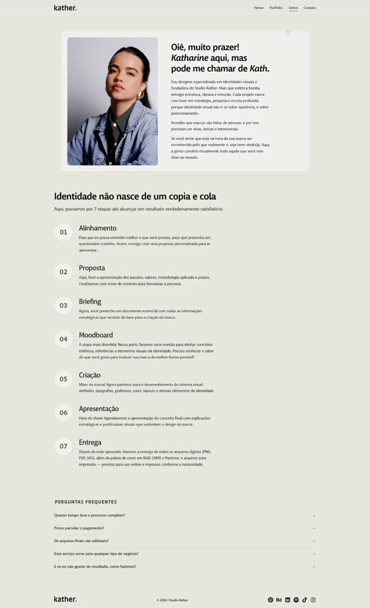

<div align="center">

# kather.

**Studio Kather — Identidade Visual & Naming**

Site oficial da designer Katharine, especializada em criar identidades visuais estratégicas e nomes de marca para negócios que querem ser reconhecidos pelo que realmente são.

🌐 [studiokather.com](https://studiokather.com)


</div>

---

## ✨ Sobre o projeto

Este repositório contém o código-fonte do site institucional do **Studio Kather**, desenvolvido com React, TypeScript e Vite.

O site foi construído para apresentar os serviços, portfólio e processo de trabalho da Katharine — designer especializada em identidade visual e naming — transmitindo os mesmos valores que ela entrega aos clientes: **estrutura, clareza e emoção**.

---

## 📄 Páginas

| Página        | Descrição                                                                                           |
| ------------- | --------------------------------------------------------------------------------------------------- |
| **Home**      | Hero com proposta de valor, marcas atendidas, portfólio em destaque, depoimentos, seção sobre e FAQ |
| **Portfólio** | Galeria completa de projetos de identidade visual e naming                                          |
| **Sobre**     | Apresentação da Kath, filosofia de trabalho e processo em 7 etapas                                  |
| **Contato**   | Canal direto via WhatsApp para alinhar escopo e proposta                                            |

---

## 🛠️ Tecnologias

- [React](https://react.dev/) — biblioteca de interface
- [TypeScript](https://www.typescriptlang.org/) — tipagem estática
- [Vite](https://vitejs.dev/) — bundler e dev server
- [Tailwind CSS](https://tailwindcss.com/) — estilização utilitária
- [Hostinger](https://www.hostinger.com/) — deploy e hospedagem

---

## 🚀 Rodando localmente

**Pré-requisitos:** Node.js 18+ e npm

```bash
# Clone o repositório
git clone https://github.com/jeiel2013/studiokather.git

# Entre na pasta
cd studiokather

# Instale as dependências
npm install

# Inicie o servidor de desenvolvimento
npm run dev
```

Acesse [http://localhost:5173](http://localhost:5173) no seu navegador.

---

## 📦 Scripts disponíveis

```bash
npm run dev        # Inicia o servidor de desenvolvimento
npm run build      # Gera o build de produção
npm run preview    # Visualiza o build localmente
npm run lint       # Verifica o código com ESLint
```

---

## 📁 Estrutura do projeto

```
studiokather/
├── public/              # Arquivos estáticos
├── src/
│   ├── assets/          # Imagens e fontes
│   ├── components/      # Componentes reutilizáveis
│   ├── pages/           # Páginas (Home, Portfólio, Sobre, Contato)
│   ├── App.tsx          # Componente raiz e rotas
│   └── main.tsx         # Ponto de entrada
├── index.html
├── vite.config.ts
└── tsconfig.json
```

---

## 🌐 Deploy

O site é hospedado na [Hostinger](https://www.hostinger.com/).

**URL de produção:** [studiokather.com](https://studiokather.com)

---

## 📸 Screenshots

> _Screenshots serão adicionados em breve._





---

## 📬 Contato

Desenvolvido por [Jeiel](https://github.com/jeiel2013) para o **Studio Kather**.

Para falar com a Kath sobre identidade visual:
👉 [studiokather.com/contato](https://studiokather.com/contact)

---

<div align="center">
  <sub>© 2026 Studio Kather. Todos os direitos reservados.</sub>
</div>
